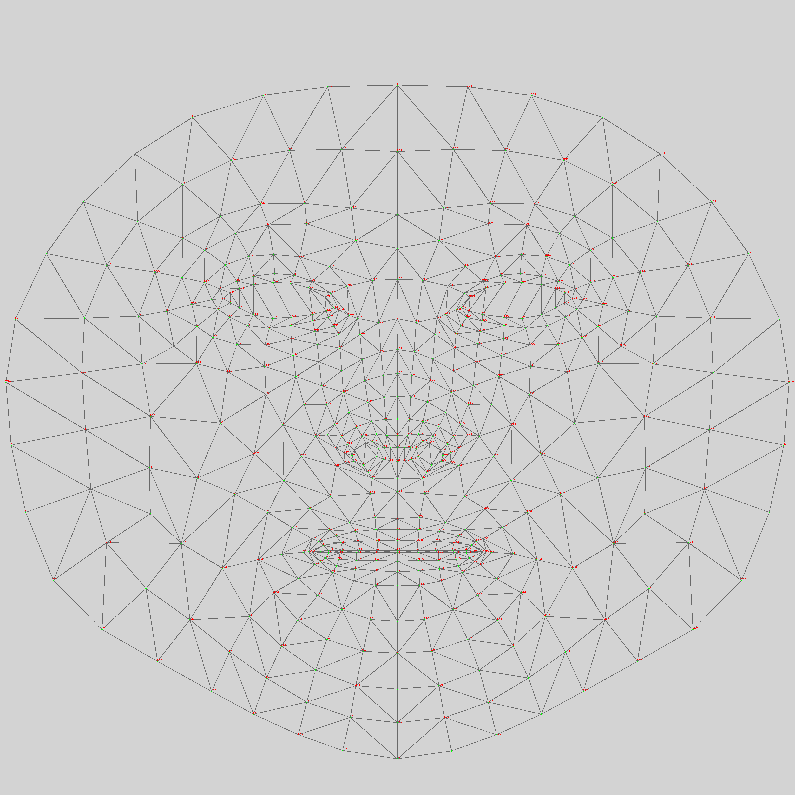

# Parkinson's Disease Detection from Smile Videos

Detect Parkinson's Disease (PD) from short facial/smile video clips using
**facial Action Units** (OpenFace) and **geometric facial-landmark features**
(MediaPipe FaceMesh), followed by a machine-learning classifier (SVM).

This repository was originally two Google Colab notebooks. It has been
converted into clean, offline, VS Code / command-line runnable Python scripts.

---

## How it works

The project has two stages:

```
 video clips (.mp4)
        │
        ▼
┌───────────────────────────────────────────────┐
│ Stage 1 — Feature extraction                   │
│ src/smile_features_extractor.py                │
│                                                │
│  OpenFace  → 7 Action Units (intensity/presence)│
│  MediaPipe → 468 landmarks → 7 geometric feats │
│  aggregate per clip: mean, variance, entropy   │
└───────────────────────────────────────────────┘
        │
        ▼
 features table (CSV)  ── e.g. data/Extracted_feautures2.csv
        │            (one row per clip, 42 feature columns + PD label)
        ▼
┌───────────────────────────────────────────────┐
│ Stage 2 — Model training & evaluation          │
│ src/pd_detection_model.py                      │
│                                                │
│  balance → split → feature selection (ablation)│
│  → correlation pruning → SVM tuning (Optuna)   │
│  → evaluate on held-out test set → save model  │
└───────────────────────────────────────────────┘
        │
        ▼
 trained model + metrics + plots  (models/)
```

### The 14 facial signals

Two complementary sources describe each smile. **7 geometric signals** come from
MediaPipe FaceMesh landmarks, and **7 Facial Action Units** come from OpenFace.
Each of the 14 signals is aggregated over the clip's frames into **mean**,
**variance** and **entropy** → **42 features per clip**.

#### A. MediaPipe FaceMesh — geometric signals

MediaPipe FaceMesh estimates **468 3D landmarks** per frame. Seven facial
distances are computed from specific landmark pairs and normalised by the
**Inter-Canthal Distance** (ICD, the distance between inner-eye landmarks
133 ↔ 362) so they are invariant to face size and camera distance.

<p align="center">
  
  <br>
  <em>MediaPipe FaceMesh canonical 468-landmark topology.
  Source: <a href="https://github.com/google-ai-edge/mediapipe">google-ai-edge/mediapipe</a> (Apache-2.0).</em>
</p>

| Geometric signal | What it measures | # landmark pairs |
|------------------|------------------|:---------------:|
| Left Eye Open  | Upper-to-lower left-eyelid opening   | 7 |
| Right Eye Open | Upper-to-lower right-eyelid opening  | 7 |
| Jaw Open       | Vertical jaw / chin drop             | 7 |
| Mouth Open     | Inner upper-to-lower lip separation  | 7 |
| Left Eyebrows Raised  | Left-brow-to-eye height       | 5 |
| Right Eyebrows Raised | Right-brow-to-eye height      | 5 |
| Mouth Width    | Left-to-right lip-corner distance    | 1 |

> The exact landmark indices for every pair are defined in `FEATURE_PAIRS`
> inside [`src/smile_features_extractor.py`](src/smile_features_extractor.py),
> following the distance definitions of the source paper.

#### B. OpenFace — Facial Action Units (AUs)

OpenFace estimates the intensity (`_r`, scale 0–5) of facial muscle movements
defined by the Facial Action Coding System (FACS). Seven AUs relevant to smiling
and facial expressivity are kept:

| Action Unit | FACS name | Muscle activity |
|-------------|-----------|-----------------|
| AU01 | Inner Brow Raiser | Raises inner eyebrows |
| AU06 | Cheek Raiser      | Raises cheeks (a *genuine* smile marker) |
| AU12 | Lip Corner Puller | Pulls lip corners up → **smile** |
| AU14 | Dimpler           | Tightens lip corners |
| AU25 | Lips Part         | Lips separate |
| AU26 | Jaw Drop          | Jaw lowers |
| AU45 | Blink             | Eye blink |

> Reduced facial expressivity ("facial masking" / hypomimia) is a known motor
> sign of Parkinson's disease, which is what these AU and geometric signals aim
> to quantify. AU reference: the
> [OpenFace wiki](https://github.com/TadasBaltrusaitis/OpenFace/wiki/Action-Units).

---

## Dataset

The underlying videos come from **YouTubePD**, a dataset of facial video clips
of Parkinson's and control subjects.

> ⚠️ **The raw videos are confidential and are NOT included in this repository.**
> They contain identifiable clips of patients, so they cannot be redistributed.
> Only the **derived, de-identified feature table** is shared — it holds numeric
> aggregate statistics per clip and **no video, imagery, or personal identifiers**.

### `data/Extracted_feautures2.csv`

The extracted-feature table that Stage 2 trains on:

| Property | Value |
|----------|-------|
| Rows (clips) | 251 total → **243 labelled** (8 rows with a missing `PD` label are dropped during cleaning) |
| Columns | 44 = `clip` + `PD` + **42 numeric features** |
| Class balance | **186** control (`PD=0`) · **57** Parkinson's (`PD=1`) |
| Missing values | none in the 42 feature columns |
| Clip identifier | `clip`, e.g. `video0_final … video283_final` (251 unique clips) |

**Column layout:**

- `clip` — clip identifier (string).
- `PD` — label: `0` = control, `1` = Parkinson's.
- `42` feature columns — the **14 signals × 3 statistics** (`_mean`, `_var`,
  `_entropy`), e.g. `Jaw Open_mean`, `AU12_r_var`, `Left Eye Open_entropy`.

Because it contains only per-clip numeric summaries, this CSV is safe to share
and is all you need to reproduce the model results.

---

## Repository layout

```
Parkinsons-smile-detection/
├── README.md
├── requirements.txt
├── data/
│   └── Extracted_feautures2.csv     # ready-to-train feature table (243 labelled clips)
├── docs/
│   └── images/                      # figures used in this README
├── src/
│   ├── smile_features_extractor.py  # Stage 1: videos → features
│   └── pd_detection_model.py        # Stage 2: features → trained model
├── notebooks/                       # original Colab notebooks (reference only)
│   ├── Smile_Features_Extractor.ipynb
│   └── PD_Detection_Model.ipynb
└── models/                          # generated outputs (git-ignored)
```

---

## Setup

Requires **Python 3.10+**. From the repository root:

```bash
# (recommended) create an isolated environment
python3 -m venv .venv
source .venv/bin/activate          # Windows: .venv\Scripts\activate

# install dependencies
pip install -r requirements.txt
```

> **NumPy version matters.** `shap`, `xgboost` and `scipy` in this project are
> built against the NumPy 1.x ABI. `requirements.txt` pins `numpy<2.0`; if you
> see a *"module compiled using NumPy 1.x cannot run in NumPy 2.x"* error, run
> `pip install "numpy<2.0"`.

---

## Quick start — train the model

You can train immediately using the included feature table
(`data/Extracted_feautures2.csv`) — **no videos or OpenFace needed**.

```bash
# fast smoke test (small search, ~1 min) — verifies the pipeline end to end
python3 src/pd_detection_model.py --quick

# full run (ablation over feature-set sizes + 50-trial Optuna SVM tuning)
python3 src/pd_detection_model.py
```

> **Note:** the full run is compute-heavy — the ablation study runs SHAP-based
> feature selection across the whole grid and can take ~20+ minutes on a laptop.
> Use `--quick` for a fast end-to-end check, or narrow the grid with
> `--n-features-list 10 15`.

Outputs are written to `models/`:

| File | Description |
|------|-------------|
| `pd_svm_model.joblib` | Trained pipeline (scaler + SVM) + selected feature list |
| `metrics.json`        | Chosen configuration and test-set metrics |
| `ablation_results.csv`| Full ablation grid (AUROC per config) |
| `ablation_study.png`  | AUROC vs. number of features per selection method |
| `corr_before/after_pruning.png` | Correlation heatmaps |
| `final_evaluation.png`| Confusion matrix, ROC and precision-recall curves |

### Useful options

```bash
python3 src/pd_detection_model.py \
    --csv data/Extracted_feautures2.csv \
    --output-dir models \
    --n-features-list 10 15 20 25 30 \   # feature-set sizes to try
    --cv-folds 10 \                      # ablation CV folds
    --n-trials 50 \                      # Optuna SVM-tuning trials (0 = defaults)
    --tune-folds 5                       # CV folds inside Optuna
python3 src/pd_detection_model.py --help
```

### Using the saved model for prediction

```python
import joblib, pandas as pd

bundle = joblib.load("models/pd_svm_model.joblib")
model, features = bundle["model"], bundle["features"]

df = pd.read_csv("data/Extracted_feautures2.csv")
X = df[features].fillna(df[features].mean())

pred  = model.predict(X)            # 0 = No PD, 1 = PD
proba = model.predict_proba(X)[:, 1]  # probability of PD
```

---

## Results

Final model: **SVM** (`C=95.64`, `gamma=0.0915`, `kernel=rbf`) with a
`StandardScaler`, on **9 features** selected by the ablation study and
correlation pruning. Evaluated on the held-out test set (23 clips):

| Metric | Score |
|--------|-------|
| AUROC | 0.9242 |
| Accuracy | 0.8696 |
| F1-score | 0.8800 |
| Sensitivity (Recall) | 1.0000 |
| Specificity | 0.7500 |
| PPV (Precision) | 0.7857 |
| NPV | 1.0000 |

**Selected features:** `AU06_r_var`, `Jaw Open_mean`, `Mouth Width_var`,
`AU26_r_mean`, `Left Eyebrows Raised_entropy`, `Left Eye Open_var`,
`AU12_r_var`, `AU45_r_mean`, `AU25_r_mean`.

### Changes to the original Colab notebooks

The only intentional change is the hyper-parameter *search engine* (Weights &
Biases cloud sweep → offline Optuna); both perform Bayesian optimization over
the same `C` / `gamma` / `kernel` space. When the script auto-tunes from
scratch, Optuna may settle on slightly different hyper-parameters and therefore
a comparable — not necessarily bit-identical — AUROC, because the small test set
(23 clips) makes the metric move in coarse steps.

---

## Modeling pipeline (what `pd_detection_model.py` does)

1. **Load & clean** — read the CSV, impute missing feature values with column
   means, coerce to numeric.
2. **Balance** — random under-sample the majority class to equalise classes
   (the raw data is imbalanced: 186 non-PD vs. 57 PD).
3. **Split** — stratified 80/20 train/test.
4. **Ablation study** — grid over feature-selection method
   (Logistic Regression, SHAP-based Boosted-RFE, SHAP-based Boosted-RFA) ×
   scaler (MinMax, Standard) × classifier (SVM, AdaBoost, HistGradientBoosting,
   XGBoost, RandomForest) × feature-set size, scored by mean AUROC over
   stratified K-fold CV. The best configuration is selected.
5. **Correlation pruning** — drop features with |correlation| > 0.9, keeping the
   higher-ranked one.
6. **SVM tuning** — **Optuna** Bayesian search over `C`, `gamma`, `kernel`
   (a fully offline replacement for the original Weights & Biases sweep).
7. **Final evaluation** — train on the training split, evaluate on the held-out
   test set (AUROC, accuracy, F1, sensitivity, specificity, PPV, NPV), and save
   the model, metrics and plots.

> The included dataset is small (243 clips), so absolute metrics are indicative,
> not clinical. Treat this as a research/educational pipeline.

---

## Stage 1 — extracting features from your own videos (optional)

Only needed if you want to build a feature table from raw videos rather than
using the provided CSV. This stage needs two external tools that are **not**
pip-installable via `requirements.txt`:

### 1. MediaPipe + OpenCV

```bash
pip install mediapipe opencv-python
```

### 2. OpenFace

Build OpenFace from source and note the path to its `FeatureExtraction` binary.
See the official guide:
<https://github.com/TadasBaltrusaitis/OpenFace/wiki>

On macOS/Linux the binary is typically at
`OpenFace/build/bin/FeatureExtraction`.

### Run the extractor

```bash
python3 src/smile_features_extractor.py \
    --video-dir /path/to/video_clips \
    --output-dir features_output \
    --openface-bin /path/to/OpenFace/build/bin/FeatureExtraction
# or set the binary once:  export OPENFACE_BIN=/path/to/FeatureExtraction
```

This produces, under `features_output/`:

- `<clip>_landmarks.csv` — raw MediaPipe landmarks per frame
- `per_frame_features.csv` — geometric features + AUs for every frame
- `clip_stats.csv` — **one aggregated row per clip** (same layout as
  `Extracted_feautures2.csv`)

**Add the label.** `clip_stats.csv` does not contain the `PD` column — that is
your clinical ground-truth label. Add a `PD` column (`0` = healthy, `1` = PD)
to each clip's row, then pass the file to the model script with `--csv`.

---

## License / disclaimer

Research and educational use only. This is **not** a medical device and must not
be used for diagnosis.
